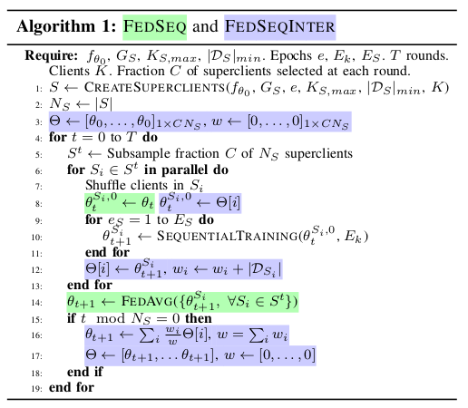
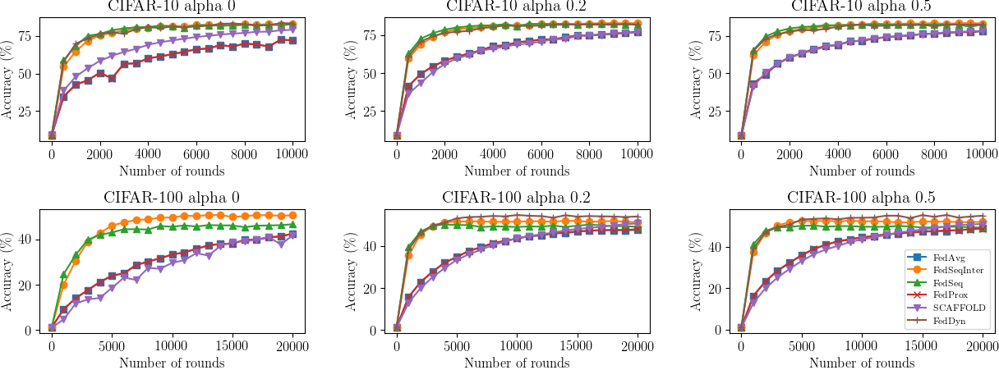

# FedSeq Official
Official PyTorch implementation of _"[Speeding up Heterogeneous Federated Learning
with Sequentially Trained Superclients](https://arxiv.org/abs/2201.10899)"_, accepted at ICPR 2022

**Authors**: Riccardo Zaccone, Andrea Rizzardi, Debora Caldarola, Marco Ciccone, Barbara Caputo.

## Abstract
Federated Learning (FL) allows training machine learning models in privacy-constrained scenarios by enabling the cooperation of edge devices without requiring local data sharing. This approach raises several challenges due to the different statistical distribution of the local datasets and the clients' computational heterogeneity. In particular, the presence of highly non-i.i.d. data severely impairs both the performance of the trained neural network and its convergence rate, increasing the number of communication rounds requested to reach a performance comparable to that of the centralized scenario. As a solution, we propose FedSeq, a novel framework leveraging the sequential training of subgroups of heterogeneous clients, i.e. superclients, to emulate the centralized paradigm in a privacy-compliant way. Given a fixed budget of communication rounds, we show that FedSeq outperforms or match several state-of-the-art federated algorithms in terms of final performance and speed of convergence. Finally, our method can be easily integrated with other approaches available in the literature. Empirical results show that combining existing algorithms with FedSeq further improves its final performance and convergence speed. We test our method on CIFAR-10 and CIFAR-100 and prove its effectiveness in both i.i.d. and non-i.i.d. scenarios.

## Algorithm



This software additionally implements the following SOTA algorithms:
- [X] FedAvg - from [McMahan et al., Communication-Efficient Learning of Deep Networks from Decentralized Data](https://arxiv.org/abs/1602.05629)
- [X] FairAvg - from [Michieli at al., Are all users treated fairly in
federated learning systems?](https://openaccess.thecvf.com/content/CVPR2021W/RCV/papers/Michieli_Are_All_Users_Treated_Fairly_in_Federated_Learning_Systems_CVPRW_2021_paper.pdf)
- [X] FedProx - from [Li at al., Federated Optimization in Heterogeneous Networks
](https://arxiv.org/abs/1812.06127)
- [X] SCAFFOLD - from [Karimireddi et al., SCAFFOLD: Stochastic Controlled Averaging for Federated Learning](https://arxiv.org/abs/1910.06378)
- [X] FedDyn - from [Acar et al., Federated Learning Based on Dynamic Regularization](https://arxiv.org/abs/2111.04263)

## Performance




## Installation

### Requirements
To install the requirements, you can use the provided requirement file and use pip in your (virtual) environment:
```shell
# after having activated your environment
$ pip install -r requirements/requirements.txt
```

## Guide for users

### Running batch jobs
The script in ``experiment_runner.py`` is made to facilitate the reproduction of results reported in the paper.
The script is intended to be used in an environment that uses SLURM: it generates as many bash scripts as the requested
combinations of parameters, grouping them basing on the experiment being described. In the script you already find
all the experiments' description. Then it automatically issues the ```sbatch <script.sh>``` command to put all the runs
in the SLURM queue.

If you want only to generated those ``.sh`` scripts without issuing the ``sbatch`` command,
give the ``run_sbatch=False`` parameter to the runner constructor:
```python

    r: Runner = SlurmRunner(experiment_config.get("seed"), default_params=train_defaults,
                            defaults={"--mem": "5GB"}, run_sbatch=False)
```
### Perform a single run
If you just want to run a configuration without any additional complexity, simply run the ```train.py``` specifying the
command line arguments. Please note that default arguments are specified in ```./config``` folder
and all is configured such that the parameters are the ones reported in the paper. For example, to run our bare
FedSeq algorithm on cifar10, just issue:
```shell
# runs FedSeq on CIFAR-10 with default parameters specified in config files
$ python train.py algo=fedseq dataset=cifar10 n_round=10000
```
This software uses Hydra to configure experiments, for more information on how to provide command
line arguments, please refer to the [official documentation](https://hydra.cc/docs/advanced/override_grammar/basic/).

## Guide for developers
If you are a developer, you may want to extend our software to implement other SOTA algorithms or use
it as baseline to add your algorithm. In that case, the information in this section may be useful to bootstrap
you into the logic of how the software is written.

### Main modules
The whole program gravitates around three type of components: a controller, that usually takes the name of
the algorithm implemented (e.g FedAvg, FedSeq), a client and a center server. The controller coordinates how
the clients interact with the center server, defining the training procedure. For each type of component, this
program defines a base (abstract) class you can inherit from: 
- ```FedBase``` for the control loop of your federated algorithm;
- ```CenterServer``` for implement the functionalities of your server;
- ```Client```for implement the local training procedure of your client.

#### Algo and FedBase
```Algo``` is the interface for any algorithm to be used in the ```main.py``` file: it specifies the main features
any algorithm should implement, like:
- Fitting a model (provided during object initialization);
- Performing a single train step;
- Saving a checkpoint and loading all the necessary information from one previuosly created;
- Saving final results.

The class implements much of the boilerplate needed to perform a model fit: in your subclass
you may want to specialize the ```_fit()``` method, that defines the steps for fitting the model according
to your algorithm. Beware that there is another method called ```fit()```: it is the method exposed by the interface,
but it is just a wrapper for ```_fit()``` that adds the automatic result saving
at training completed and error handling during training, assuring you save a checkpoint of the last
iteration run.


```FedBase``` implements the operations that are common to most of the Federated Learning algorithms: it defines the main loop in which clients are selected, trained, 
aggregated and then a validation on the resulting model is performed. Details on how the training step should work are
to be defined in the ```train_step()``` method, in the subclass you may want to create.

```FedBase``` already implements all the data partitioning, client and center server creation: our suggestion is to
start from there and specialize only the methods you need: most of the cases is only the train step (e.g. this is the
case of ```FedAvg``` and ```FedSeq```).

#### Center Server
```CenterServer``` is the interface for the server component of any FL algorithm. The main  method to be defined in the
proper subclass is ```aggregate```: it takes the clients trained in the current round and the corresponding aggregation
weights, and performs the aggregation according to the rule defined by the algorithm. These parameters are passed down
by the controller. If your algorithm needs additional parameters that are known before instantiating the server, they
should be passed using the property ```center_server.args``` in the ```.yaml``` file corresponding to your algorithm:
for example, FedDyn requires the server to know the parameter ```alpha``` and the total number of clients involved in
the training (in general greater than the number of clients selected for the current round), so these parameters are 
passed in ``feddyn.yaml``, thanks to the flexibility of Hydra.

A server should also properly define the methods ``state_dict()`` and ``load_state_dict()``, that are used to produce
and use checkpoints.

#### Client
``Client`` is the interface for the client component of any FL algorithm. The main method to be defined in the proper
subclass is ```client_update()```: it defines the local training made by a client. Other methods you may need to
specialize are ```send_data()``` and ```receive_data()```: these methods define what a client send to the server and
what a client is expected to receive from the central server. There is a coupling between what a client expects and what
the server sends: a client implementing the SCAFFOLD algorithm, for example, needs to receive the server controls, so
the center server (```SCAFFOLDCenterServer``` class) sends them in its ```send_data```.

### Suggestions on how to combine them
If your algorithm changes the client training procedure, then you may want to subclass the ```Client``` class and define your
own ```client_update()``` method. If your method just uses a different loss function that has the same signature of the
common cross-entropy loss, you can actually do less work by creating a loss function in ```src/losses```, export it
in the losses module, create a `.yaml` file in the corresponding `config/algo/loss` folder and pass it as an argument in 
the configuration file or in the command line. Same reasoning applies if you just use another optimizer different from
SGD: indeed it is how FedProx is implemented (if you seach for a ```FedProx``` class you won't find it because of this).

If your algorithm changes the aggregation logic of the clients' model, then you may want to subclass the ```CenterServer```
class: this is the case of FedDyn and SCAFFOLD algorithms. In general the center server is coupled to the client, and the
extent of this coupling is defined by what the client receives from a server (```client.receive_date()```), and what the server
sends (```center_server.send_data()```). 


## Paper
**Speeding up Heterogeneous Federated Learning with Sequentially Trained Superclients**
_Riccardo Zaccone, Andrea Rizzardi, Debora Caldarola, Marco Ciccone, Barbara Caputo_ <br>

[[Paper]](https://arxiv.org/abs/2201.10899)

## How to cite us

```
@misc{zaccone2022speeding,
      title={Speeding up Heterogeneous Federated Learning with Sequentially Trained Superclients}, 
      author={Riccardo Zaccone and Andrea Rizzardi and Debora Caldarola and Marco Ciccone and Barbara Caputo},
      year={2022},
      eprint={2201.10899},
      archivePrefix={arXiv},
      primaryClass={cs.LG}
}
```